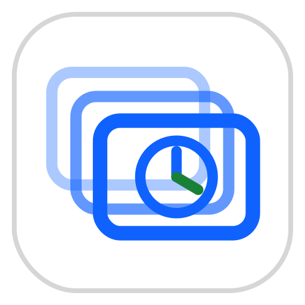
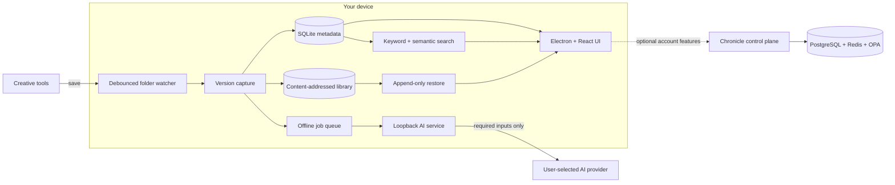

<p align="center">
  <a href="https://chronicle.quick2query.com/">
    
  </a>
</p>

<h1 align="center">Chronicle</h1>

<p align="center">
  <strong>Know what changed. Find any version.</strong>
</p>

<p align="center">
  Automatic, local-first version history for creative work, with plain-English AI explanations
  and search that works the way you remember.
</p>

<p align="center">
  <a href="https://chronicle.quick2query.com/"><strong>Visit the landing page</strong></a>
  ·
  <a href="https://github.com/Santi-49/Chronicle/releases/latest"><strong>Download Chronicle</strong></a>
  ·
  <a href="https://chronicle.quick2query.com/privacy/">Privacy</a>
  ·
  <a href="https://chronicle.quick2query.com/terms-and-services/">Terms of Service</a>
</p>

<p align="center">
  <a href="https://github.com/Santi-49/Chronicle/releases/latest"></a>
  <a href="https://github.com/Santi-49/Chronicle/actions/workflows/ci.yml"></a>
  <a href="https://github.com/Santi-49/Chronicle/stargazers"></a>
</p>

<p align="center">
  
  
  
  
  
  
  
  
</p>

<p align="center">
  Desktop builds are available for <strong>Windows</strong> and <strong>macOS</strong>.
</p>

---

## Why Chronicle?

Developers have Git. Creative professionals often have `final_final_v8`.

Chronicle watches the folders where you already work and turns every meaningful save into a
version. It then explains the visible change in plain English, indexes that history, and lets you
restore any earlier state without asking you to learn commits, branches, or a new file workflow.

- **Capture automatically:** save normally in your creative tool and Chronicle records the version.
- **Understand every revision:** AI describes what changed between the previous file and the new one.
- **Search by memory:** queries like `the version with the tagline` find the relevant revision.
- **Restore safely:** an old revision returns as a new version, preserving the complete timeline.
- **Keep ownership:** the version library, metadata, and keyword search stay on your computer.

Current MVP capture supports **PNG, JPG, and JPEG**. SVG, PSD, PSB, BLEND, OBJ, and STEP/STP are
the selected expansion path for vector, layered-image, 3D, game-art, architecture, and product
design workflows.

## See Chronicle in action

<p align="center">
  <a href="https://chronicle.quick2query.com/landing-video.mp4">
    
  </a>
</p>

<p align="center">
  <a href="https://chronicle.quick2query.com/landing-video.mp4"><strong>Watch the full product demo</strong></a>
  ·
  <a href="https://chronicle.quick2query.com/">Explore the interactive landing page</a>
</p>

## How it works



The desktop app is the product. Capture, history, thumbnails, restore, and keyword search do not
depend on Docker, a Chronicle account, or the control plane. AI is asynchronous: saves appear
immediately, offline work is queued, and annotations arrive when the configured provider becomes
reachable.

### Engineering properties

| Property | Implementation |
|---|---|
| Save detection | `chokidar`, recursive watching, temporary-file filtering, and an approximately 2 second settle window |
| Version identity | SHA-256 content detection prevents duplicate versions when the bytes did not change |
| Local persistence | SQLite metadata plus a deduplicated, content-addressed file library |
| Restore semantics | Append-only restore, comparable to `git revert`, with missing-folder Save a copy fallback |
| AI runtime | Local FastAPI sidecar over `127.0.0.1`, built with LangChain and packaged with the desktop app |
| AI providers | Google Gemini, Anthropic Claude, and OpenAI through encrypted bring-your-own-key configuration |
| Search | SQLite FTS5 keyword ranking plus provider/model-scoped embedding similarity |
| Offline behavior | Capture, timeline, restore, and keyword search remain available; AI and embeddings queue |
| Renderer security | Context-isolated Electron renderer with a typed, validated IPC bridge |
| Optional control plane | FastAPI, async SQLAlchemy, PostgreSQL, Redis-backed JWT sessions, and OPA RBAC |
| Boundary contracts | TypeScript IPC, generated OpenAPI clients, JSON Schema, and Python Protocols where appropriate |

## Quick start

### Requirements

- Node.js 22 recommended
- Python 3.12
- GNU Make
- Git Bash or WSL when using Make on Windows
- Docker Desktop only for the optional control plane and full backend checks

### Default: desktop app, no Docker

This is the MVP path and the one to use for normal Chronicle development. It does not
require Docker, a backend, or an account.

**Development requires:** Node.js 20+, Python 3.12, and GNU make. Python runs the local
AI service in development and builds a self-contained native sidecar. The installed Windows and
macOS apps bundle that sidecar and do **not** require system Python.
On Windows, run make from Git Bash or WSL.

```bash
make setup      # install desktop dependencies and prepare demo-assets/workspace/
make run        # open Electron with hot reload
make build      # build the desktop app
make package    # create a Windows installer .exe in apps/desktop/dist/
make package-macos # on macOS, create a .dmg in apps/desktop/dist/
```

This installs the desktop dependencies, prepares the demo workspace, and opens Electron with hot
reload. The default local workflow does not require an account or Docker.

If Electron's downloaded binary needs repair:

```bash
make ensure-electron
make run
```

Without Make:

```bash
npm --prefix apps/desktop ci
npm --prefix apps/desktop run ensure-electron
npm --prefix apps/desktop run dev
```

### Enable AI summaries

In development, the app captures versions without AI. To enable summaries and semantic indexing, install
the loopback AI service and its default Gemini provider, then save a provider key in
**Settings → AI summaries**. Electron starts and health-checks the service automatically.

```bash
make setup-ai
```

Chronicle stores a separate encrypted key for each configured provider, so the annotation
and embedding providers can be switched independently without re-entering credentials.
The engine, packaged sidecar, and predefined UI support Google Gemini, Anthropic Claude, and OpenAI;
developer mode accepts another LangChain-supported provider/model pair. Both task selectors
require their selected provider's key before Save is enabled. A changed model is then
live-validated through the loopback service; this minimal real provider call may incur a tiny
charge. Changing the embeddings configuration queues existing annotation text for reindexing.

### Run the demo workflow

Add `demo-assets/workspace/` as a Chronicle project, then advance one of the controlled histories:

```bash
make demo-reset
make demo-next ASSET=logo
make demo-next ASSET=logo
make demo-status
```

The two logo advances produce a navy-to-teal revision followed by tagline removal. Additional
stories and commands live in [demo-assets/README.md](demo-assets/README.md).

## Build, package, and test

```bash
make typecheck        # TypeScript renderer and main-process checks
make test-desktop     # Electron/Vitest desktop suite
make test-ai          # Provider-mocked Python AI tests
make build            # Production desktop build
make package          # Windows NSIS installer
make package-macos    # macOS DMG, run on macOS
```

For the complete backend-aware validation, including Dockerized API tests and Ruff:

```bash
make check
```

Generated installers are written to `apps/desktop/dist/`. Published builds are available from
[GitHub Releases](https://github.com/Santi-49/Chronicle/releases/latest). Current builds are
unsigned, so Windows SmartScreen or macOS Gatekeeper may show a warning.

## Optional control plane

The control plane is not required for the local creative workflow. It provides Google sign-in,
refreshable Chronicle sessions, random installation registration, portable account settings, and
separately enabled passphrase-encrypted provider-key backup. Planned telemetry delivery and admin
analytics are separate post-MVP work.

```bash
make control-plane-up
make control-plane-health
# http://localhost:8000/docs
make control-plane-down
```

In development, the desktop reads `CHRONICLE_CONTROL_PLANE_URL` and
`GOOGLE_OAUTH_CLIENT_ID` from `.env`; the URL defaults to `http://localhost:8000`.
Use the control-plane origin only, without `/api/v1`. Packaged releases embed these
public values at build time from GitHub Actions repository variables of the same names,
so an installed app does not require environment variables or a bundled `.env` file.

## Repository map

```text
Chronicle/
├── apps/
│   ├── desktop/              Electron + React + TypeScript product
│   └── landing/              Astro marketing and legal site
├── services/
│   ├── ai/                   Local FastAPI + LangChain AI sidecar
│   ├── api/                  Optional FastAPI control plane
│   └── module/               Optional challenge gateway logic
├── packages/
│   ├── brand/                Chronicle identity and application assets
│   ├── contracts/            API, AI, IPC-adjacent generated types and schemas
│   └── prompts/              Versioned prompt assets
├── infra/                    OPA policies, PostgreSQL, and Redis configuration
├── demo-assets/              Controlled creative histories and watched workspace
├── scripts/                  Packaging, validation, and demo utilities
├── docs/                     Product, architecture, contracts, and challenge evidence
├── Makefile                  Primary developer command surface
└── docker-compose.yml        Optional backend infrastructure
```

## Contract-first architecture

Real component boundaries are defined before both sides are implemented:

| Boundary | Source of truth |
|---|---|
| React renderer to Electron main | [`apps/desktop/src/shared/ipc.ts`](apps/desktop/src/shared/ipc.ts) |
| Electron main to local AI service | [`packages/contracts/ai/openapi.json`](packages/contracts/ai/openapi.json) |
| Structured annotation output | [`packages/contracts/ai/output.schema.json`](packages/contracts/ai/output.schema.json) |
| Desktop to control plane | [`packages/contracts/api/openapi.json`](packages/contracts/api/openapi.json) |
| Backend to optional module | [`packages/contracts/module/interface.py`](packages/contracts/module/interface.py) |

Derived TypeScript clients are generated from OpenAPI. Provider choices, prompts, storage layouts,
retry behavior, and internal classes remain implementation details instead of leaking into public
contracts. See [docs/contracts.md](docs/contracts.md) for the full rules.

## Built with IBM Bob

Chronicle was planned, architected, developed, tested, packaged, and prepared for production with
**IBM Bob** as the team's primary development tool. Bob supported product research, contract-first
design, implementation across TypeScript and Python, test generation, integration diagnosis,
packaging work, and release preparation.

Every pull request records concrete Bob usage in [docs/bob-log.md](docs/bob-log.md), making the
development process a visible, judged project artifact rather than a generic tooling claim.

Chronicle is being built for the **AI Builders Challenge with IBM Bob**, part of BeMyApp and IBM
SkillsBuild's July 2026 theme, **Reimagine Creative Industries with AI**.

## Documentation

| Document | Purpose |
|---|---|
| [Project overview](docs/PROJECT_OVERVIEW.md) | Plain-language system map, glossary, architecture, and workflow |
| [Project status](PROJECT_STATUS.md) | Current readiness, blockers, decisions, and milestones |
| [Execution plan](TODO.md) | Scoped tasks, dependencies, ownership, and acceptance checks |
| [Technical specification](docs/spec.md) | Stack, engineering rules, MVP scope, and feature contracts |
| [Challenge vision](docs/challenge/VISION.md) | Product philosophy, audience, positioning, and demo story |
| [Challenge research](docs/challenge/RESEARCH.md) | Market, judges, formats, privacy, and technical findings |
| [Desktop documentation](docs/desktop/overview.md) | Screens, startup flow, settings, and feature coverage |
| [Backend reference](docs/backend/overview.md) | Authentication, RBAC, API, and database documentation |
| [Release policy](docs/releasing.md) | Versioning, packaging, promotion, and release automation |

## Privacy, terms, and support

The capture/storage core, secure IPC bridge, Python AI service, restore flow, hybrid search,
and live renderer wiring are implemented on `dev`. Users can create and edit tracked-folder
projects, choose which image files/types remain watched, configure per-provider BYOK keys,
browse live projects/timelines/version details, and inspect queued AI work. A self-contained
unsigned Windows installer now bundles the validated Gemini AI sidecar. The final three-pass
clean-machine journey and real-editor Windows smoke record remain open.

Known packaging limitations: the unsigned Windows installer can trigger SmartScreen and the
unsigned/unnotarized macOS DMG can trigger Gatekeeper; the MVP
bundle contains the live-validated Gemini integration, while other provider integrations still
require a development install; signing, Apple notarization, and in-app auto-update remain post-MVP.
See [release and version policy](docs/releasing.md) and the
[MVP-12 acceptance record](docs/mvp-12-acceptance.md).

- [Official app homepage](https://chronicle.quick2query.com/about/)
- [Privacy Policy](https://chronicle.quick2query.com/privacy/)
- [Terms of Service](https://chronicle.quick2query.com/terms-and-services/)
- [Support and issue tracker](https://github.com/Santi-49/Chronicle/issues)

Do not post API keys, tokens, private files, or other sensitive information in a public issue.

## Contributing

Start with the [project overview](docs/PROJECT_OVERVIEW.md), check the current
[project status](PROJECT_STATUS.md), and claim a bounded task from [TODO.md](TODO.md). Chronicle
uses focused branches, contract-first changes at real boundaries, generated API types, automated
checks, and pull requests into the integration workflow.

Bug reports and focused proposals are welcome through
[GitHub Issues](https://github.com/Santi-49/Chronicle/issues).

## Contributors

Thank you to everyone building Chronicle.

<p align="center">
  <a href="https://github.com/Santi-49/Chronicle/graphs/contributors">
    
  </a>
</p>
