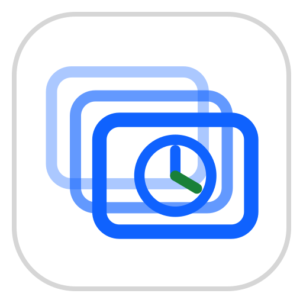
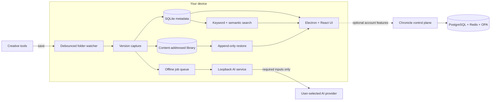

<p align="center">
  <a href="https://chronicle.quick2query.com/">
    
  </a>
</p>

<h1 align="center">Chronicle</h1>

<p align="center">
  <strong>Know what changed. Find any version.</strong>
</p>

<p align="center">
  Automatic, local-first version history for creative work, with plain-English AI explanations
  and search that works the way you remember.
</p>

<p align="center">
  <a href="https://chronicle.quick2query.com/"><strong>Visit the landing page</strong></a>
  ·
  <a href="https://github.com/Santi-49/Chronicle/releases/latest"><strong>Download Chronicle</strong></a>
  ·
  <a href="https://chronicle.quick2query.com/help/">Help center</a>
  ·
  <a href="https://chronicle.quick2query.com/privacy/">Privacy</a>
  ·
  <a href="https://chronicle.quick2query.com/terms-and-services/">Terms of Service</a>
</p>

<p align="center">
  <a href="https://github.com/Santi-49/Chronicle/releases/latest"></a>
  <a href="https://github.com/Santi-49/Chronicle/actions/workflows/ci.yml"></a>
  <a href="https://github.com/Santi-49/Chronicle/stargazers"></a>
</p>

<p align="center">
  
  
  
  
  
  
  
  
</p>

<p align="center">
  Desktop builds are available for <strong>Windows</strong> and <strong>macOS</strong>.
</p>

---

## Why Chronicle

Developers have Git. Creative professionals have `campaign-final-FINAL-v2.png`.

Git solved history for code because code is text and diffs are readable. Creative files are
binary, so designers get no history, no diff, and no *why*. They improvise one with filenames —
and then lose the version they actually wanted.

**Chronicle's insight: AI can make the evolution of creative files understandable the way Git
made source-code history understandable.** Point it at the folders you already work in, keep
saving normally, and every meaningful save becomes a version with a plain-English explanation
of what changed:

> Background changed from navy to teal; the tagline was removed.

That turns a folder of ambiguous files into a searchable history you can actually reason
about — helping creators **work smarter** without asking them to learn commits, branches, or a
new file workflow.

### Why not just use what already exists

Every existing option fails on the same two counts: it covers **one tool or one format**, and it
**never explains the change**.

| The existing option | Formats it covers | AI summary or real diff? |
|---|---|---|
| **Git / Git LFS** | Any file, but treats creative ones as opaque blobs | **No** — text diffs only; a designer gets a new blob, not an explanation |
| **Figma version history** | Figma files only | **No** |
| **Photoshop cloud documents** | Photoshop cloud documents only — local `.psd` gets temporary snapshots | **No** |
| **Adobe Creative Cloud versions** | Adobe formats only | **No** |
| **Dropbox, Google Drive** | Any file, as an opaque snapshot | **No** — never says what changed |
| **Creative tools' own autosaves** | One tool each — Blender, Maya, After Effects, Premiere | **No** — numbered recovery backups, unexplained and unsearchable |
| **SolidWorks PDM, Fusion** | Their own CAD formats, inside managed enterprise setups | **No** |

**Chronicle is one tool for all of them.** Eight creative formats — raster, vector, layered
design, 3D, and CAD — captured in the same local history, each change written down in plain
language, and the whole thing searchable by meaning.

There is no comparable product. Nothing else writes a plain-language change summary for a
creative file, and nothing else keeps a single history across the formats a real creative
workflow actually uses.

## See Chronicle in action

<p align="center">
  <a href="https://chronicle.quick2query.com/landing-video.mp4">
    
  </a>
</p>

<p align="center">
  <a href="https://chronicle.quick2query.com/landing-video.mp4"><strong>Watch the full product demo</strong></a>
  ·
  <a href="https://chronicle.quick2query.com/">Explore the interactive landing page</a>
</p>

## How it works

<table>
<tr>
<td width="25%" valign="top">

**01 · Save normally**

Choose a folder once, then keep working in Photoshop, Blender, or whatever you already use.

</td>
<td width="25%" valign="top">

**02 · Captured automatically**

The save becomes a local version in the background. Nothing waits on AI; earlier versions are never touched.

</td>
<td width="25%" valign="top">

**03 · Explained and found**

AI describes the visible change, then search finds the version from ordinary words like *"the version with the tagline."*

</td>
<td width="25%" valign="top">

**04 · Restored safely**

Restoring version 6 creates version 9. The full creative history stays intact.

</td>
</tr>
</table>

## Key features

<table>
<tr><td width="34%">&nbsp; <strong>Automatic capture</strong></td>
<td>Every settled save becomes a version — debounced, temp-file aware, and deduplicated by SHA-256, so re-saving unchanged bytes costs nothing</td></tr>

<tr><td>&nbsp; <strong>Plain-English AI diffs</strong></td>
<td>A model compares the previous version with the new one and reports the difference as a change list plus searchable tags — across all eight formats, not just flat images</td></tr>

<tr><td>&nbsp; <strong>Hybrid search</strong></td>
<td>One box, two engines: SQLite FTS5 keyword ranking plus embedding similarity, so <em>"blue background"</em> finds the version that never mentioned the word</td></tr>

<tr><td>&nbsp; <strong>Safe restore</strong></td>
<td>Restoring writes the old bytes back and appends a <em>new</em> version, like <code>git revert</code>. History is never rewritten, and a missing folder becomes <em>Save a copy…</em></td></tr>

<tr><td>&nbsp; <strong>Eight creative formats</strong></td>
<td>PNG, JPG, SVG, PSD, PSB, OBJ, STEP/STP, and BLEND all capture, version, preview, restore, and keyword-search — including an interactive 3D viewer for meshes and CAD</td></tr>

<tr><td>&nbsp; <strong>Projects, not just files</strong></td>
<td>Tracked folders become named projects with a real folder browser, per-file-type capture rules, and a <em>Removed files</em> area with a 30-day retention window instead of silent loss</td></tr>

<tr><td>&nbsp; <strong>Local-first and offline-safe</strong></td>
<td>The version library, database, and keyword index never leave the device. Capture, timeline, restore, and keyword search need no network, no account, and no Docker</td></tr>

<tr><td>&nbsp; <strong>Model-agnostic AI, your own key</strong></td>
<td>Google Gemini, Anthropic Claude, or OpenAI through LangChain — configured independently for summaries and embeddings, encrypted per provider, and live-validated before it saves</td></tr>

<tr><td>&nbsp; <strong>Activity &amp; Cost dashboard</strong></td>
<td>A contribution-style calendar of your own captures, summaries, searches, and restores, plus live per-model pricing — so AI spend is visible instead of a surprise</td></tr>

<tr><td>&nbsp; <strong>Validated with real creatives</strong></td>
<td>Tested by designers and creative professionals on their own working files, not only on synthetic demo assets</td></tr>
</table>

### Shipped, not prototyped

<p>
  
  
  
  
  
  
  
  
</p>

Chronicle is not a demo branch with a screen recording. It is a released product with the
operational surface real software needs:

| | |
|---|---|
| **Real installers** | Branded Windows NSIS installer and macOS DMG, published from a tagged CI build with verified update metadata and checksums |
| **Auto-update** | Windows detects, downloads, and restarts into a new release; unsigned macOS honestly *detects* and hands off the matching DMG rather than promising an install it cannot perform |
| **Runs in the background** | Tray-resident capture survives closing the window, with optional start-at-login read back from the OS rather than mirrored into settings |
| **Live control plane** | A deployed FastAPI + PostgreSQL + Redis + OPA service behind a Cloudflare Tunnel — with Google Sign-In over system-browser OAuth + PKCE, portable settings, and end-to-end-encrypted key backup the server cannot decrypt |
| **Admin analytics** | A five-view, role-gated control center (Overview, Product, Audience & releases, Reliability, Users & access) reading real, content-free usage from live installations |
| **GDPR controls** | Documented lawful basis, versioned preference auditing, configured retention, JSON export, and transactional self-service account and cloud-data erasure |
| **Hosted legal terms** | Versioned [Privacy Policy](https://chronicle.quick2query.com/privacy/) and [Terms of Service](https://chronicle.quick2query.com/terms-and-services/), accepted in-app and re-prompted when either version changes |
| **Public help center** | A static, searchable [help site](https://chronicle.quick2query.com/help/) written for non-technical creatives — setup, provider keys, costs, privacy, and troubleshooting |
| **Release automation** | Conventional commits → Release Please version PR → protected-branch CI → tagged installers and generated changelogs |
| **First-run onboarding** | A native installer wizard plus a resumable in-app coach-mark tour that completes against real project, timeline, and AI state |

## Built for this challenge

Chronicle is built for the **AI Builders Challenge with IBM Bob** (BeMyApp · IBM SkillsBuild),
July 2026 theme: **Reimagine Creative Industries with AI** — *"build solutions that help creators
work smarter."*

| Judging criterion | How Chronicle answers it |
|---|---|
| **Technical Execution** | IBM Bob across the full lifecycle, contract-first boundaries, 326 desktop + 143 Python tests, protected-branch CI, and a released cross-platform product with auto-update — not a prototype |
| **Innovation** | A plain-language diff of a *binary* creative file, meaning-based search over that history, and one timeline spanning raster, vector, layered design, 3D, and CAD. Nothing comparable exists today |
| **Challenge Fit** | AI already writes commit messages — but only for **code**, in IDEs, in Copilot, in Bob itself. Chronicle brings that same idea to the files creative professionals actually make: images, vector art, layered documents, 3D scenes, and CAD models |
| **Implementation & Feasibility** | Local-first and offline-safe by design; users bring their own AI provider key with live cost transparency; eight formats, real installers, GDPR controls, hosted terms, and a public help center |
| **Real-World Impact** | `final_v8`. Every creative professional has that folder, and every one of them has lost time digging through it for a version they knew existed. Chronicle removes that unpaid work with no change to how anyone already works |

**→ The full case, including the competitive landscape and evidence for each criterion, is in
[docs/challenge-fit.md](docs/challenge-fit.md).**

## Built with IBM Bob

**IBM Bob was the team's primary development tool across the entire lifecycle** — matching the
five-stage collaboration model IBM SkillsBuild itself teaches, with the team directing,
reviewing, testing, and refining every contribution:

| Stage | Examples from Chronicle |
|---|---|
| **Understand the problem** | Researched the creative-format landscape, the judging criteria, and where existing version history genuinely falls short |
| **Plan the solution** | Contract-first boundary design (C1–C7), the format registry that replaced fourteen hardcoded extension checks, and the scoped task board |
| **Build the solution** | Watcher, content-addressed capture, Python AI service, hybrid search, restore, control plane, admin analytics, updater, and tray residency |
| **Improve and refine** | Diagnosed the packaged Google token exchange, a stale Cloudflare canonical URL, orphaned AI sidecars, refresh-token races, and a `net.fetch` timeout that never aborted |
| **Document and share** | This README, the architecture and contract docs, the public help center, and the release runbook |

Every pull request records concrete Bob usage in **[docs/bob-log.md](docs/bob-log.md)**, making
the development process a visible, verifiable artifact rather than a generic tooling claim. Bob
remained the primary tool throughout; other AI assistants worked alongside it in parallel, and log
entries tagged *Bob + AI-assisted* record where they did.

## Architecture


```mermaid
flowchart LR
    TOOL[Creative tools] -->|save| WATCH[Debounced folder watcher]

    subgraph DEVICE[Your device]
        WATCH --> CAPTURE[Version capture]
        CAPTURE --> DB[(SQLite metadata)]
        CAPTURE --> LIB[(Content-addressed library)]
        CAPTURE --> QUEUE[Offline job queue]
        QUEUE --> AI[Loopback AI service]
        DB --> SEARCH[Keyword + semantic search]
        LIB --> RESTORE[Append-only restore]
        DB --> UI[Electron + React UI]
        SEARCH --> UI
        RESTORE --> UI
    end

    AI -->|required inputs only| PROVIDER[User-selected AI provider]
    UI -. optional account features .-> API[Chronicle control plane]
    API --> DATA[(PostgreSQL + Redis + OPA)]
```

**The desktop app is the product.** Capture, history, previews, restore, and keyword search
depend on no Docker, no account, and no control plane. AI is always asynchronous: versions
appear instantly, offline work queues, and annotations arrive when the configured provider
becomes reachable.

| Property | Implementation |
|---|---|
| Save detection | `chokidar` recursive watching, temp-file filtering, ~2 s settle window |
| Version identity | SHA-256 content detection; identical bytes are stored once, even across assets |
| Local persistence | SQLite metadata plus a deduplicated, content-addressed file library |
| Format support | One registry (`shared/formats.ts`) drives the watcher, capture, previews, media protocol, AI requests, and UI |
| AI runtime | Local FastAPI + LangChain sidecar over `127.0.0.1`, bundled with the app — installed users need no Python |
| Search | SQLite FTS5 keyword ranking plus provider/model-scoped embedding similarity |
| Renderer security | Context-isolated Electron renderer behind a typed, validated IPC bridge — no filesystem, database, or key access |

### Contract-first boundaries

Real component boundaries are defined before either side is implemented, using each
boundary's native mechanism:

| Boundary | Source of truth |
|---|---|
| React renderer ↔ Electron main | [`apps/desktop/src/shared/ipc.ts`](apps/desktop/src/shared/ipc.ts) |
| Electron main ↔ local AI service | [`packages/contracts/ai/openapi.json`](packages/contracts/ai/openapi.json) |
| Structured annotation output | [`packages/contracts/ai/output.schema.json`](packages/contracts/ai/output.schema.json) |
| Desktop ↔ control plane | [`packages/contracts/api/openapi.json`](packages/contracts/api/openapi.json) |
| Backend ↔ optional module | [`packages/contracts/module/interface.py`](packages/contracts/module/interface.py) |

TypeScript clients are generated from OpenAPI, never hand-written. Prompts, provider choices,
storage layout, and retry behavior stay implementation details instead of leaking into public
contracts — see [docs/contracts.md](docs/contracts.md) and
[docs/architecture/overview.md](docs/architecture/overview.md).

## AI approach

Chronicle's AI layer is a **local Python sidecar**, not a cloud service and not a wrapper
library:

- **Model-agnostic through LangChain.** `init_chat_model` and `init_embeddings` resolve the
  user's provider and model — Gemini, Claude, and OpenAI ship in the installer, and any other
  LangChain-supported pair works in developer mode. There are no custom provider wrappers.
- **Two operations, one contract.** *Annotation* returns a structured summary, change list,
  tags, and optional confidence; *embedding* returns vectors for semantic search. Both are
  fixed by C3, so prompts and orchestration can improve without a breaking change.
- **Local extraction before inference.** Proprietary container bytes never reach a provider. A
  PSD, SVG, OBJ, STEP, or BLEND file is parsed on-device into a bounded structure diff plus at
  most one derived preview image, so the model receives the smallest useful evidence — and
  extraction limits become honest coverage warnings that cap the reported confidence.
- **Capability discovery, not assumption.** The service publishes the formats it can annotate via
  `GET /capabilities`, and the app asks instead of assuming. A version an older sidecar cannot
  handle waits in the queue rather than failing.
- **Bring your own key.** Users supply their own provider credential. It is encrypted per
  provider with Electron `safeStorage`, is never readable by the renderer, and is never sent to
  Chronicle's backend.

**→ Full detail: [docs/ai-approach.md](docs/ai-approach.md).**

## Quick start

**Requirements:** Node.js 20+ (22 recommended) · Python 3.12 · GNU Make (Git Bash or WSL on
Windows) · Docker Desktop *only* for the optional control plane.

```bash
make setup      # install desktop dependencies and prepare demo-assets/workspace/
make run        # open Electron with hot reload
```

That is the whole default path — no Docker, no backend, no account. Then enable AI summaries
and semantic search:

```bash
make setup-ai   # install the loopback AI service and its default Gemini provider
```

…and save a provider key in **Settings → AI summaries**. Electron starts and health-checks the
service automatically.

Try the controlled demo history — add `demo-assets/workspace/` as a project, then:

```bash
make demo-reset
make demo-next ASSET=logo   # navy → teal
make demo-next ASSET=logo   # tagline removed
```

**→ Full setup, packaging, testing, control-plane, and contributor workflow:
[docs/getting-started.md](docs/getting-started.md).**

## Current limitations

Stated plainly, because an honest boundary is more useful than an implied one:

- **Installers are unsigned.** Windows SmartScreen and macOS Gatekeeper may warn; the
  [help center](https://chronicle.quick2query.com/help/) documents the safe recovery path.
  Code signing and Apple notarization are post-MVP.
- **Non-image formats are summarized from extracted evidence, not a full render.** Chronicle
  never launches Blender, Photoshop, or a CAD kernel to produce a picture. A `.blend` summary,
  for example, is based on the file header and the thumbnail Blender itself embeds — so those
  formats report a lower confidence ceiling and say what their evidence covered.
- **In-place auto-update is Windows-only.** macOS detects a release and opens the DMG, because
  an unsigned bundle cannot be replaced in place.
- **Asset identity is the file path.** Renaming or moving a file starts a new asset;
  content-hash identity across renames is future work.
- **The AI-inference gateway is not built.** Every AI path is currently bring-your-own-key.

## Documentation

| Document | Purpose |
|---|---|
| [Challenge fit](docs/challenge-fit.md) | The judging case: problem, differentiation, competitive landscape, and evidence per criterion |
| [AI approach](docs/ai-approach.md) | How the AI layer is designed, what it sends, and what it never sends |
| [Getting started](docs/getting-started.md) | Setup, commands, packaging, testing, control plane, and contributor workflow |
| [Project overview](docs/PROJECT_OVERVIEW.md) | Plain-language system map, glossary, and team workflow |
| [Technical specification](docs/spec.md) | Stack, engineering rules, MVP scope, and feature contracts F1–F10 |
| [Contracts](docs/contracts.md) | The C1–C7 boundary map and change rules |
| [Architecture](docs/architecture/overview.md) | Services, request flow, and component map |
| [Desktop app](docs/desktop/overview.md) | Every screen, the startup flow, settings, and feature coverage |
| [Backend reference](docs/backend/overview.md) | Authentication, RBAC, API, and database |
| [Privacy policy record](docs/privacy-policy.md) | Lawful basis, retention schedule, and rights implementation |
| [Release policy](docs/releasing.md) | Versioning, packaging, promotion, and release automation |
| [IBM Bob log](docs/bob-log.md) | Per-PR record of how Bob was used |
| [Project status](PROJECT_STATUS.md) · [Task board](TODO.md) | Current readiness and scoped work |

## Repository map

```text
Chronicle/
├── apps/
│   ├── desktop/              Electron + React + TypeScript product
│   └── landing/              Astro marketing, help center, and legal site
├── services/
│   ├── ai/                   Local FastAPI + LangChain AI sidecar
│   ├── api/                  Optional FastAPI control plane
│   └── module/               Optional challenge gateway logic
├── packages/
│   ├── brand/                Chronicle identity and application assets
│   ├── contracts/            API, AI, and module types and schemas
│   └── prompts/              Versioned prompt assets
├── infra/                    OPA policies, PostgreSQL, and Redis configuration
├── demo-assets/              Controlled creative histories and watched workspace
├── scripts/                  Packaging, validation, and demo utilities
├── docs/                     Product, architecture, contracts, and challenge evidence
├── Makefile                  Primary developer command surface
└── docker-compose.yml        Optional backend infrastructure
```

## Privacy and support

The creative version library, watched paths, previews, database, annotations, and keyword index
stay on the device. Chronicle provides no cloud storage for that library.

Two exceptions are named rather than glossed over: **configured AI inference** sends the inputs
a task requires to the provider the user selected, and **optional account features** (sign-in,
portable settings, encrypted key backup, usage reporting) talk to the control plane. Usage
reporting carries no creative content, file or project names, paths, summaries, tags, search
text, credentials, or raw IP addresses — and can be turned off in Settings.

- [Help center](https://chronicle.quick2query.com/help/) — setup, provider keys, costs, troubleshooting
- [Official app homepage](https://chronicle.quick2query.com/about/)
- [Privacy Policy](https://chronicle.quick2query.com/privacy/) · [Terms of Service](https://chronicle.quick2query.com/terms-and-services/)
- [Support and issue tracker](https://github.com/Santi-49/Chronicle/issues)

Do not post API keys, tokens, private files, or other sensitive information in a public issue.

## Contributing

Start with the [project overview](docs/PROJECT_OVERVIEW.md), check
[project status](PROJECT_STATUS.md), and claim a bounded task from [TODO.md](TODO.md). Chronicle
uses focused branches, contract-first changes at real boundaries, generated API types, automated
checks, and reviewed pull requests — see [docs/getting-started.md](docs/getting-started.md) for
the working agreement.

Bug reports and focused proposals are welcome through
[GitHub Issues](https://github.com/Santi-49/Chronicle/issues).

## Contributors

Thank you to everyone building Chronicle.

<p align="center">
  <a href="https://github.com/Santi-49/Chronicle/graphs/contributors">
    
  </a>
</p>
