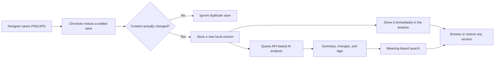
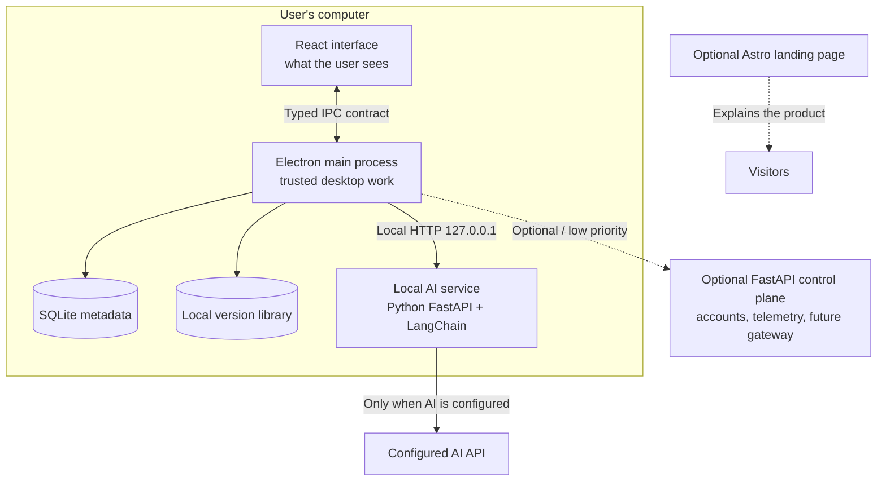
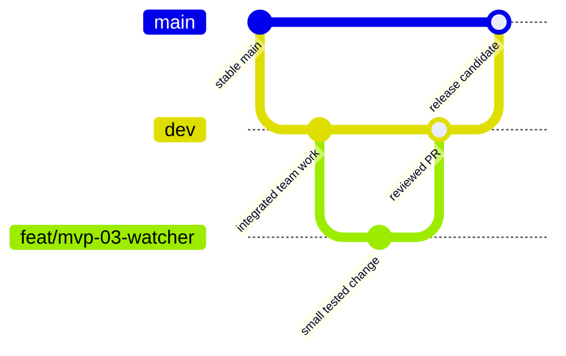

# Chronicle — Whole-Project Overview

> A short introduction for every team member, including people who are new to the
> repository or do not work primarily in software.

For today's progress and next action, read [Project Status](../PROJECT_STATUS.md). To claim
work, use the [MVP Task Board](../TODO.md).

## What are we building?

Chronicle is a desktop application for people who repeatedly edit creative images.

Today, a designer may have files such as:

```text
logo-final.png
logo-final-2.png
logo-final-REALLY-FINAL.png
```

Chronicle replaces that confusion with an automatic history. The user chooses a folder,
continues working normally, and every meaningful save becomes a version. AI then explains
the visible change in plain language, such as:

> Background changed from navy to teal; the tagline was removed.

Later, the user can browse the timeline, search for “the version with the tagline,” or
restore an older version without deleting history.

## The MVP in one picture



The important experience is: **save normally → see a new version → understand what changed.**

## What “local-first” means here

Chronicle keeps the version library and database on the user's computer. It does not upload
the whole library to Chronicle's backend.

AI is different: the MVP uses external APIs through LangChain. The AI code itself runs in
a small **local Python AI service** on the user's computer (`services/ai/` — not the
optional backend); if the user enables AI, that service sends the images required for a
comparison either directly to their configured provider (BYOK) or, later, through
Chronicle's optional gateway. There is no local AI model in the MVP.

Without a network connection, Chronicle can still capture versions, show cached history,
restore files, and perform keyword search. AI summaries and semantic embeddings wait in a
queue until the configured provider is reachable.

## The parts of the project



### Desktop app — the product

`apps/desktop/` is where nearly all MVP work happens.

- The **renderer** is the React interface: pages, buttons, cards, timeline, and search results.
- The **main process** is the trusted desktop side: folder watching, file access, hashing,
  SQLite, encrypted credentials, AI jobs, and restore operations.
- The **preload bridge** is the narrow, safe connection between them.

The renderer must never directly access the filesystem, database, API key, or Node.js APIs.
The current UI consumes only the typed preload bridge: tracked folders appear as projects
with a name, optional description, icon, color, enabled image types, and persistent ignored
files. A live status bar links to the renderer-safe pending AI-job queue.

### Local storage

- **SQLite** stores descriptions of assets and versions, AI text, tags, settings, and jobs.
- The **version library** stores the actual image bytes by their SHA-256 content hash.
- Identical bytes are stored once, even if they appear more than once.
- The original working folder remains the user's normal folder; Chronicle does not replace it.

### AI layer

AI features are developed in Python in `services/ai/` — a small FastAPI service that runs
locally next to the app (it is not the optional backend, and it needs no Docker). The
Electron main process sends it annotation/embedding requests over `127.0.0.1`; inside,
LangChain connects to the selected API provider. The contract requires a structured
annotation—summary, change list, and tags—but does not dictate whether the implementation
uses one prompt, several steps, tools, OCR, or deterministic assistance.

Prompt assets are Markdown files with YAML metadata in `packages/prompts/`. They are
implementation assets that can improve through testing without changing the AI contract.
BYOK credentials remain write-only from the renderer and are encrypted separately for each
provider, allowing annotation and embedding providers to be changed independently.

### Optional backend

`services/api/` already provides authentication and role-based access. Chronicle may later
use it for account preferences, privacy-safe telemetry, and hosted AI inference. It is not
required for the MVP and must not block the desktop app.

`services/module/` is reserved for the future hosted gateway logic. Do not implement it until
the local/BYOK MVP works.

### Optional landing page

`apps/landing/` is a marketing page. It can explain Chronicle publicly, but it provides no
core product functionality and is lower priority than the desktop MVP and submission video.

## What is a contract?

A contract is an agreement between two parts of the system. Think of it like a paper form:
one person knows which fields they must fill in, and another knows what completed form they
will receive. Neither needs to know how the other person did their work.

For example, the AI annotation contract says:

```text
Input:  current image, optional previous image, and file name
Output: summary, list of changes, and searchable tags
Purpose: describe a first version or explain what changed
```

It does **not** say which prompt, model, tool, retry algorithm, or internal class must be used.

Contracts let people work in parallel, but only if everyone respects them:

- Do not silently add, rename, or remove fields.
- Do not make one side depend on undocumented behavior.
- If the contract is genuinely wrong, propose a small contract change before changing both sides.
- Contract changes may require tests, generated types, documentation, and migrations—not just one edit.

See [Contracts and Implementation Specifications](contracts.md) for the full map.

## How team branches work

The repository currently has `main`. Before implementation work starts, the team lead should
create `dev` and protect both shared branches.



### `main` — stable and presentable

`main` is the version we could show judges or release. Nobody develops directly on it.
Only reviewed, tested release candidates move from `dev` to `main`.

### `dev` — shared integration

`dev` combines finished tasks from the team. A feature is not considered complete until its
PR is reviewed, tests pass, and it is merged into `dev`. Nobody should push directly to it.

### `feat/...`, `fix/...`, and `docs/...` — your workspace

- `feat/mvp-03-watcher` adds a planned feature.
- `fix/duplicate-save` corrects a bug.
- `docs/demo-script` changes documentation only.

These branches are temporary. Create one from the latest `dev`, keep it focused on one task,
and open a PR back into `dev`.

### A normal work session

```bash
git checkout dev
git pull
git checkout -b feat/mvp-03-watcher

# Work only inside the task's listed file boundary.
# Run the required tests and update docs/bob-log.md.

git add <only-the-files-you-intended>
git commit -m "feat(watcher): capture settled image saves"
git push -u origin feat/mvp-03-watcher
```

Then open a pull request into `dev`. Ask for review; do not merge merely because an AI
assistant says the code is correct.

## How work is divided safely

The [MVP Task Board](../TODO.md) gives each task:

- A single goal
- Dependencies that must finish first
- Files it may edit
- Files it must not edit
- Contracts it must uphold
- A measurable “done when” check

File boundaries reduce merge conflicts. They are not permission to ignore the rest of the
project. Before implementing one part, every owner should understand the user journey and
the diagram above.

If a task unexpectedly needs another owner's file, talk first. Do not make a convenient
cross-cutting change and leave the other owner to discover it during merge.

## Important words in plain language

| Term | Meaning |
|---|---|
| Asset | One tracked working file, such as `logo.png`. |
| Version | One captured state of that asset after its bytes changed. |
| Hash | A content fingerprint. Equal SHA-256 hashes mean the bytes are identical. |
| SQLite | A small database stored as one local file inside the desktop app. |
| Electron | Technology that packages a web-style interface as a desktop application. |
| React | The library used to build Chronicle's visible interface. |
| IPC | The controlled message bridge between the visible interface and trusted desktop code. |
| LangChain | The Python library used to call AI APIs without tying Chronicle to one provider. |
| AI service | A small Python program (`services/ai/`) running on the user's computer that the desktop app asks for AI results. Not the optional backend. |
| BYOK | “Bring your own key”: the user supplies an AI provider credential stored encrypted locally. |
| Embedding | A list of numbers representing meaning, used for semantic search. |
| Semantic search | Search by meaning rather than only exact words. |
| Queue | A saved list of work to do later, such as AI calls waiting for connectivity. |
| Contract | The agreed functionality and input/output format at a boundary. |
| PR / pull request | A request for teammates to review and merge a branch. |
| MVP | The smallest complete product required for the submission demonstration. |

## What humans must decide

An AI assistant can help compare options and implement an approved choice. It cannot take
responsibility for product judgment. Team members must actively decide:

- Whether the workflow is genuinely useful and understandable to designers
- Which provider offers acceptable quality, cost, privacy, and access
- Which visual style represents Chronicle and reads well in a short video
- Which demo edits best prove the product instead of merely producing attractive screenshots
- Whether a new dependency or abstraction is truly necessary
- Whether restore and privacy explanations are safe and honest
- Whether tests reproduce real editor and user behavior
- Whether the submission accurately describes what has actually been built

You should be able to explain every merged decision in your own words. If you cannot, pause,
read the relevant docs, inspect the generated code, and ask another team member.

## Where to read next

| If you need… | Read… |
|---|---|
| Current progress, blockers, and next actions | [Project Status](../PROJECT_STATUS.md) |
| A task to claim with exact file boundaries | [MVP Task Board](../TODO.md) |
| Exact MVP behavior and acceptance examples | [Team Specification](spec.md) |
| Why Chronicle should exist and the demo story | [Solution Vision](challenge/VISION.md) |
| Challenge rules, judging, and submission requirements | [Challenge](challenge/CHALLENGE.md) |
| Contract definitions and change rules | [Contracts](contracts.md) |
| Screens and user navigation | [Desktop Overview](desktop/overview.md) |
| System/service architecture | [Architecture Overview](architecture/overview.md) |
| Backend details | [Backend Overview](backend/overview.md) |
| Setup commands | [Getting Started](getting-started.md) |
| How IBM Bob was used | [Bob Log](bob-log.md) |

