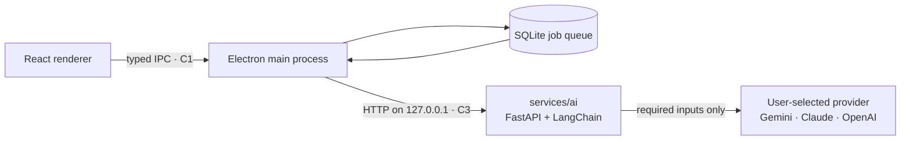

# AI Approach

> How Chronicle applies AI, what leaves the device, and which decisions were deliberate.
>
> Companion reading: [Contracts](contracts.md#chronicle-contract-map-jul-18-milestone--agree-here-before-implementing) ·
> [Spec §4 F4/F7](spec.md) · [Provider validation research](challenge/RESEARCH.md#default-ai-providermodel-validation-validate-01-2026-07-21)

---

## 1. What the AI is for

Chronicle uses AI for exactly two jobs. Both exist because binary creative files have no
readable diff.

| Operation | Input | Output | Feature |
|---|---|---|---|
| **Annotation** | The new version, the previous version (or `null` for a first version), and the file name | `summary`, `changes[]`, `tags[]`, optional nullable `confidence` | The plain-English change explanation (F4) |
| **Embedding** | The text of a version's summary and tags, or a search query | A vector | Meaning-based history search (F7) |

Notably absent: no chatbot, no image generation, no agent loop, no image embeddings. Each was
considered and deferred to the roadmap because neither judged criterion nor user journey needed
it for this release. The AI does one hard thing well.

---

## 2. Where the AI code runs

AI is implemented **once, in Python**, in a local FastAPI sidecar — not in the renderer, not in
the cloud, and not duplicated in JavaScript.



- The **renderer** never touches AI, keys, or the network. It reads status through C1.
- The **Electron main process** owns the durable job queue, retry policy, and the sidecar's
  lifecycle. It health-checks the service and reaps it on quit.
- The **AI service** is stateless and loopback-only. It has no database, no auth, and persists
  nothing — including the API key, which arrives per request.

This is **not** the optional control plane (`services/api/`). Both happen to use FastAPI; that
is all they share. The AI sidecar is part of the desktop product and needs no Docker, no
Postgres, and no account.

**Why Python rather than LangChain.js in Electron:** the team develops AI features in Python,
LangChain's Python package is the reference implementation, and the stretch inference gateway
(F9) can reuse this exact code instead of maintaining a JavaScript twin. The accepted trade-off
is that *development* needs Python 3.12 — installed builds bundle a self-contained PyInstaller
sidecar, so users never install Python.

### Service surface (C3)

| Endpoint | Purpose |
|---|---|
| `GET /health` | Liveness and version, used by the main process before dispatching work |
| `GET /capabilities` | Which formats this build can annotate — the app asks instead of assuming |
| `POST /annotate` | One annotation, with explicit format routing |
| `POST /embed-text` | One embedding, for interactive search queries |
| `POST /embed-texts` | An ordered batch of up to 16, for draining the index queue |
| `POST /validate-provider-model` | A minimal *real* task-specific call, used to validate configuration before it is saved |

The contract fixes inputs, outputs, and error behavior. It deliberately does **not** fix
prompts, models, retries, or orchestration — those stay implementation-owned so they can improve
without a breaking change. See [contracts.md](contracts.md).

---

## 3. Model-agnostic by construction

Chronicle resolves providers through LangChain's neutral factories — `init_chat_model` and
`init_embeddings` — using **default classes and methods only.** There are no custom provider
wrappers, no adapter hierarchy, and no abstraction invented on top of the library.

```text
Settings → AI summaries
  ├─ change summaries (vision) :  provider + model
  └─ semantic search (embeddings) : provider + model
```

The two tasks are configured **independently**, so a user can annotate with Gemini and embed
with OpenAI. Keys are stored **one per provider**, so switching a task back to a
previously-configured provider does not require re-entering the credential.

| Shipped provider | Annotation | Embeddings |
|---|---|---|
| Google Gemini *(default)* | Yes | Yes |
| Anthropic Claude | Yes | — *(no Anthropic embeddings API exists)* |
| OpenAI | Yes | Yes |

A **developer-mode** toggle accepts any free-text LangChain provider/model pair for environments
that install the integration separately. The engine never had a provider allowlist — the curated
list is renderer presentation policy, and correctness is decided by a live probe rather than a
static table.

**Why this matters for the challenge:** model-agnosticism mirrors IBM Bob's own multi-model
philosophy. Swapping in watsonx or Granite is a settings change, not a code change.

### Configuration is tested, not trusted

A provider/model pair is never persisted on the user's word. When either selector changes, the
main process asks the sidecar to make a **minimal real call on the actual task path** — a
one-pixel structured-vision request for summaries, or a short embedding request for search. A
rejected or unreachable configuration leaves the previous working settings intact and returns
plain-language feedback. Both selectors also require a saved key before Save is enabled.

That probe is a genuine provider call and may incur a tiny charge. Chronicle says so rather than
hiding it.

---

## 4. What actually gets sent

This is the part that matters for a local-first product, so it is specified rather than implied.

### The general rule

The provider receives **the minimum evidence the task needs** — never a whole project, never the
version library, never file paths, never the database.

### Per format

| Format | What the provider receives |
|---|---|
| **PNG, JPG/JPEG** | The image bytes as a standard base64 content block — a vision model reads these directly |
| **PSD, PSB** | **No Photoshop bytes.** Parsed on-device into a capped, deterministic structure diff (layer names, kinds, visibility, opacity, bounds, type-layer text) plus **at most one** derived JPEG: a first-version preview or a before/after comparison sheet, capped at 1024 px. If the normalized composites are pixel-identical, the request is text-only |
| **SVG** | The extracted vector structure as text — element inventory, geometry, and text content. SVG is text-based, so no rasterization is needed |
| **OBJ** | A mesh inventory (vertex and face counts, objects, groups, materials, bounds) plus a locally derived flat-shaded 2D preview |
| **STEP/STP** | The schema, an entity-type inventory, and geometric bounds. No CAD kernel is invoked, so there is no render |
| **BLEND** | The file header plus the thumbnail Blender itself embeds when saving. Blender is never launched and the scene is never opened |

Every non-image adapter follows the same shape — **safe local extraction → bounded structured
evidence → at most one derived preview → annotation** — and each declares a confidence ceiling
reflecting how completely it can see its format:

| Format | Confidence ceiling when evidence is partial |
|---|---|
| SVG | 0.85 |
| OBJ | 0.80 |
| STEP/STP | 0.70 |
| BLEND | 0.65 |

Local extraction before inference is a deliberate architectural stance: **do not hand a model an
opaque proprietary container and hope it understands it.** It bounds cost, because tokens are
spent on a structured diff rather than a large flat image; it keeps proprietary bytes on the
device; and it makes the limits of each format's evidence explicit instead of letting a model
produce a fluent guess. Extraction failures are typed as local `extraction_error` responses
*before* any provider is contacted, so a corrupt file is never misreported as a provider
rejection.

Hard rule across every adapter: **nothing inside a creative file is ever executed.** No macros,
no expressions, no embedded Python, no plug-in code. Creative files are untrusted input, and
every declared length is validated against the container before anything is allocated.

### Credentials

Chronicle is **bring-your-own-key**: the user supplies their own provider credential and pays
that provider directly. Keys are encrypted per provider with Electron `safeStorage`, are **write-only across the
IPC boundary** (the renderer can never read one back), and are passed per request over loopback.
The sidecar forwards a key only to the provider it belongs to and never persists it. Keys are
never sent to Chronicle's backend — the single exception is the separately enabled, signed-in,
off-by-default encrypted key backup, which uploads an authenticated-encryption envelope the
control plane cannot decrypt.

### The honest caveat

Chronicle does not claim zero retention. Image and text inputs *do* leave the device on the
configured AI path, and what the provider does with them depends on that provider and tier —
Google's Gemini developer API, for example, uses free-tier inputs to improve products while paid
tier does not. Every user-facing surface states that the *creative library* stays local while
naming the AI-inference exception.

---

## 5. Never block the UI

A hard rule from the spec: **no user action ever waits on a model.**

1. A save is captured, hashed, stored, and visible on the timeline immediately.
2. An annotation job is enqueued in SQLite — durable across restarts.
3. A worker drains the queue asynchronously and writes the result when it arrives.
4. The UI shows the version's real state throughout: *pending → done*, *failed* with a
   cause-specific recovery action, or *deferred*.

**`deferred` is the interesting state.** A version whose format has no adapter in the *running*
service is neither failed nor retried nor left spinning — it is honestly queued, skipped during
selection so it never blocks the work behind it, and it drains by itself once an adapter is
available. That state exists because the app *asks* `GET /capabilities` rather than assuming the
sidecar matches its own format registry.

Every format Chronicle captures now has an annotation adapter, so nothing is deferred in a
current build. The mechanism stays because it is what let those formats ship to users —
captured, previewed, restorable, and keyword-searchable — *before* their adapters existed, and it
is what keeps an older installed sidecar degrading gracefully instead of failing work it cannot
yet understand.

Failures are classified rather than generic: quota/rate-limit, credential, request-size,
timeout, integration, invalid-output, and unknown each produce distinct plain-language guidance.
Quota and rate-limit failures route straight to a manual **Retry all failed jobs** action instead
of hammering the provider. Failed jobs are retained with a sanitized error, not deleted.

Offline is a status, not an error. Everything queues and backfills.

---

## 6. Search: hybrid on purpose

Semantic search alone would be a liability — it needs embeddings, embeddings need a provider, and
a provider needs network and credit. So both engines run behind one box and the user never picks
a mode:

- **Keyword** — SQLite FTS5 over summaries, tags, and file names. Always available, offline, free.
- **Semantic** — cosine similarity over stored vectors. Fills in as indexing completes.

Embedding identity is **provider-qualified** (`provider:model`), so vectors produced by different
models are never compared. Changing either embedding selector re-queues existing annotation text
for deduplicated asynchronous re-embedding — **without** rerunning vision annotation, since the
expensive part does not need repeating.

Index jobs drain in ordered batches of up to 16 texts through `POST /embed-texts`, with vector
order verified before results are attached. Interactive search queries stay single-item on
`POST /embed-text`, because throughput work must not add latency to typing.

Search always tells the user which state it is in — indexing, paused offline, or AI not
configured — and confirms in every state that keyword results remain available.

---

## 7. Prompts are versioned assets, not code

Prompt content lives **only** in [`packages/prompts/version-annotation.md`](../packages/prompts/version-annotation.md)
as Markdown with YAML front matter, loaded from there at runtime. Nothing is inlined in Python or
TypeScript.

The reason is contractual: a prompt revision is an **implementation experiment** that can be
tested and improved freely, as long as it still satisfies C3's output schema. Prompt work never
forces a boundary change — and the boundary never dictates prompt wording.

Live testing produced at least one concrete revision worth recording: the first Gemini run
returned multi-word tags containing spaces, which violated the tag format. Prompt v0.1.1 now
explicitly requires lowercase hyphenated slugs, and both reruns validated.

---

## 8. Cost transparency

Because the user pays their own provider directly, Chronicle treats cost as something to *show*,
not something to hide.

- Every AI attempt records provider, model, operation, timestamp, success, latency, and
  **nullable** token usage. Unknown stays unknown — a missing usage field is never written as
  zero.
- Chat calls read provider response metadata. Embedding calls do not return usage in LangChain's
  standard interface, so Chronicle counts with the provider's own tokenizer through LangChain's
  public `get_num_tokens` (local tiktoken for OpenAI, Google's `countTokens` endpoint for
  Gemini), storing only the integer count — never the embedded text.
- The main process refreshes one live price catalog (Models.dev), caches it for offline use, and
  stamps each estimate with the catalog hash and the exact rates used. **Completed calls are
  never repriced** by a later refresh.
- The Activity & Cost dashboard and Settings distinguish **provider-reported**, **estimated**,
  and **unavailable** amounts, state the currency and refresh time, and name the provider invoice
  as the authority.
- Nothing about this touches telemetry. It is local, private, and works without an account.

---

## 9. Deliberate non-goals

| Not built | Why |
|---|---|
| A local model | Out of scope for this release. "Local" means local storage, local orchestration, and a locally running service — inference is API-based |
| Custom AI abstractions | Library defaults only. No wrapper is added until a concrete, documented limitation requires it |
| Image embeddings / visual-similarity search | Roadmap. Text embeddings over summaries and tags already answer the demo's questions |
| A history chatbot | Roadmap. Search answers the same need with far less surface area |
| Rendering a `.blend` scene | Would require Blender itself. Chronicle reads only the thumbnail Blender embeds |
| Faithful PSD layer compositing | Uses the embedded composite preview instead of reimplementing Photoshop's renderer |
| Executing anything inside a file | Macros, expressions, embedded Python, and plug-in code are never run — creative files are untrusted input |

---

## 10. Validation status

The shipped defaults were probed live against real provider APIs and the committed demo
fixtures, not assumed. Full dated results, including latency, token usage, approximate per-call
cost, and graceful failure paths for invalid keys, unknown models, and rate limits, are recorded
in
[RESEARCH.md → Default AI Provider/Model Validation](challenge/RESEARCH.md#default-ai-providermodel-validation-validate-01-2026-07-21).

Two honest notes carried from that record:

- `gemini-flash-latest` is a **moving alias** that Google hot-swaps with each release. It works
  today; pinning a dated model ID for a rehearsed demo remains an open team decision.
- Published provider pricing lags real tier changes, so all cost figures are approximate and
  labelled as such.
